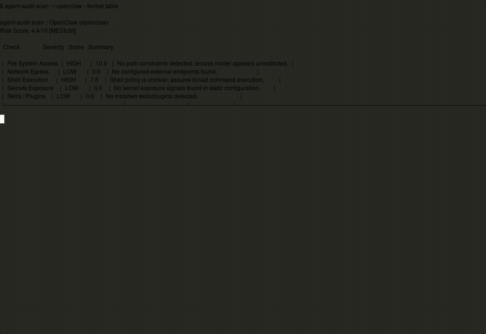

# agent-audit

Know exactly what your AI agents can do to your machine before they do it.

`agent-audit` is a security scanner for AI coding agents (OpenClaw, Claude Code, Codex, Nanobot, MCP tools). It audits filesystem scope, network egress, shell execution, secrets exposure, and plugin/skill risk.



## Security comparison snapshot

This table is generated from real `agent-audit` scans (local config + shipped fixtures):

| Agent | Risk Score | Tier | File Access | Network | Shell | Secrets | Skills |
|---|---:|---|---|---|---|---|---|
| OpenClaw (local `~/.openclaw`) | 4.4 | MEDIUM | HIGH | LOW | HIGH | LOW | LOW |
| Codex (scoped fixture) | 3.5 | MEDIUM | LOW | LOW | MEDIUM | MEDIUM | MEDIUM |
| OpenClaw (unrestricted fixture) | 9.8 | CRITICAL | CRITICAL | CRITICAL | CRITICAL | CRITICAL | HIGH |

Use this for reproducible AI agent security benchmarking in CI and local dev.

## Install

```bash
# from this repo
pip install .

# or from a built wheel
pip install dist/graniteai_agent_audit-*.whl

# or run directly from GitHub (no local install)
uvx --from git+https://github.com/ClariSortAi/agent-audit.git@v0.16.3 agent-audit scan .
```

## Quick start

```bash
agent-audit scan ~/.openclaw
agent-audit compare ~/.openclaw ~/.nanobot --format markdown
agent-audit monitor --pid 48291 --live --duration 30 --format json
```

Command formats:
- `scan --format table|json|markdown`
- `compare --format table|json|markdown`
- `monitor --pid <PID> | --exec "<cmd>"` with `--format table|json`

## Generate demo GIF

```bash
./scripts/make_demo_gif.sh
```

Output: `artifacts/demo.gif`

## Supported agents

| Agent | Status |
|---|---|
| OpenClaw | ✅ |
| Nanobot | ✅ |
| Claude Code | ✅ |
| Codex | ✅ |
| MCP (generic) | ✅ |
| Aider | 🔜 |
| Cline | 🔜 |

## How risk scoring works

Transparent weighted model (0-10):
- File system scope: 25%
- Network egress: 20%
- Shell execution: 25%
- Secrets exposure: 15%
- Skills/plugins: 15%

Details: `docs/RISK_MODEL.md`

## Add an adapter

One file, four methods, one PR.

- Adapter contract: `agent_audit/adapters/base.py`
- Guide: `docs/ADDING_ADAPTERS.md`

## FAQ

**Does this replace a sandbox?**
No. `agent-audit` is a scanner and monitor, not runtime isolation.

**Does this require importing agent code?**
No. It reads config/manifests and process telemetry only.

**Can it scan MCP-based tools?**
Yes. Includes a generic MCP adapter for endpoint/config discovery.

## Why this exists

AI coding agents are quickly getting shell, filesystem, and network access by default. Teams need a lightweight way to answer:

- what can this agent access?
- what did it actually touch?
- how risky is this setup compared to alternatives?

`agent-audit` is built for practical AI agent governance and security review without heavyweight infrastructure.

## License

MIT (`LICENSE`)
